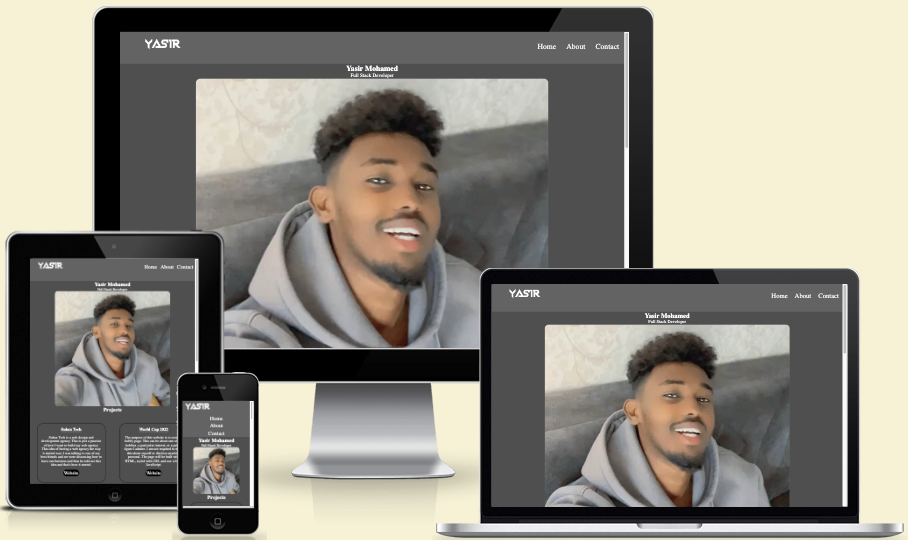
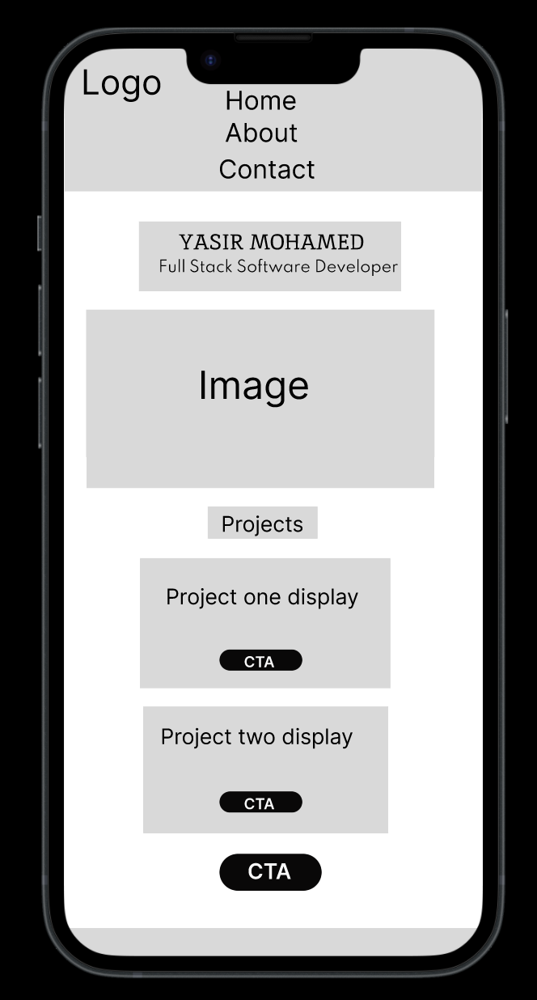
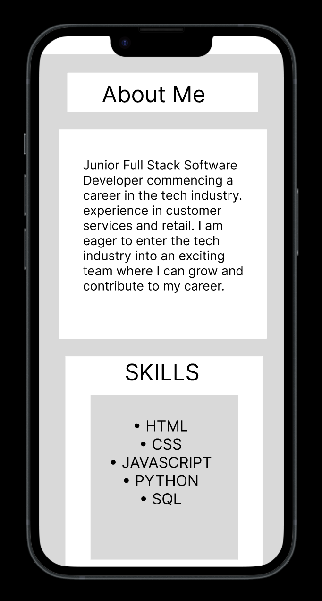
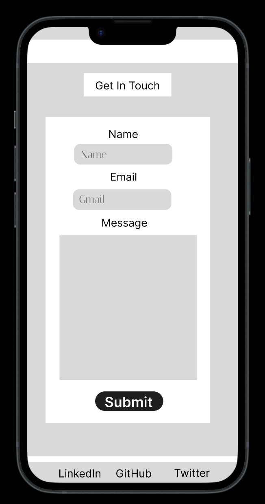
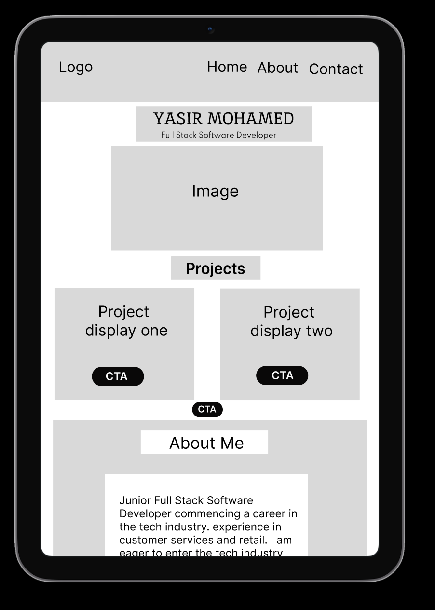
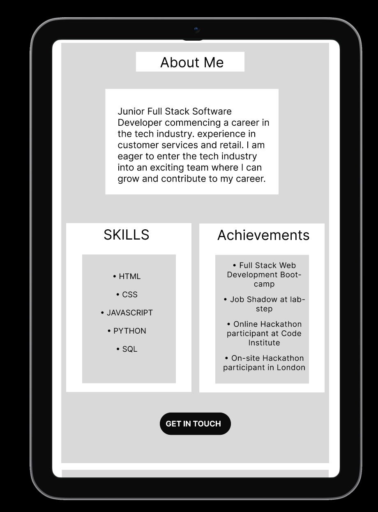
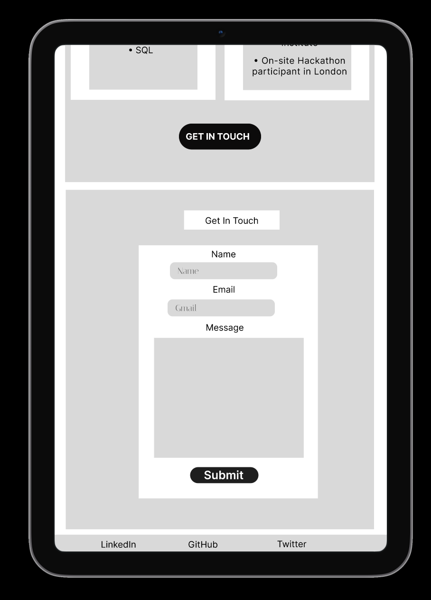
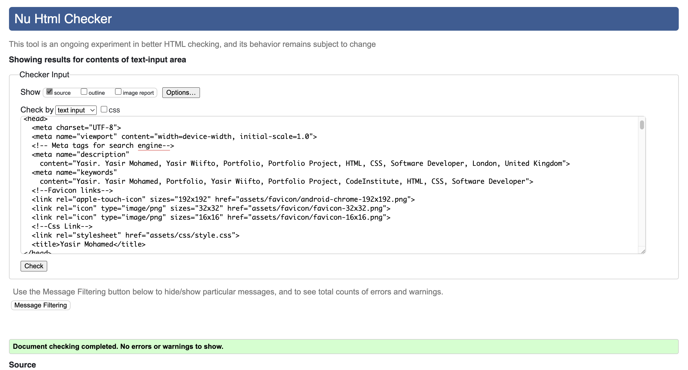
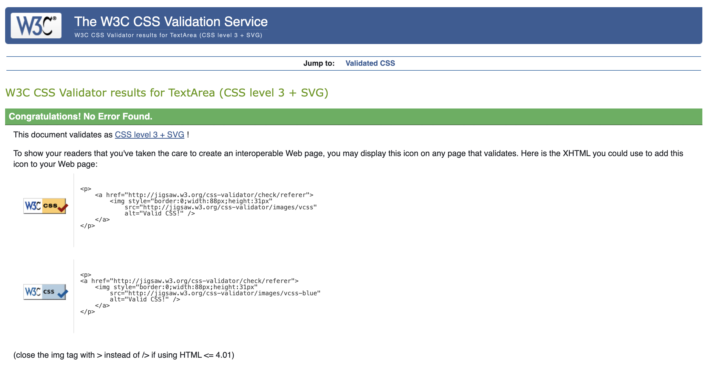

# Portfolio Project One

I am creating this portfolio as part of three series projects, this is the first project. I have used HTML & CSS to create, and it's a static website that meets the assignment criteria.

<a href="https://yasirwiifto.github.io/My-portfolio-one/index.html" target="_blank">Website Link</a>

***

## Introduction

## Table Contents
1. [**Portfolio One**](#Portfolio-one)
1. [**Planning stage**](#planning-stage)
    * [***Target Audiences***](#target-audiences)
    * [***User Stories***](#user-stories)
    * [***Site Aims***](#site-aims)
    * [***Design***](#design)
    * [***Color Scheme***](#color-scheme)
    * [***Typography***](#typography)
1. [**Features**](#features)
    * [**Home Section**](#home-section)
    * [**About Section**](#about-section)
    * [**Contact Section**](#contact-section)
1. [**Deployment**](#deployment)
1. [**Technologies**](#technologies)
1. [**Testing**](#testing)
1. [**Credits**](#credits)

***

## **Planning stage**

### **Target Audiences:**

* Potential Employers: My web developer portfolio is primarily aimed at potential employers.
I've designed it to showcase my skills and experience.

* Recruiters: I understand that recruiters often search for web developers through online portfolios. By optimizing my portfolio with relevant keywords and tags, I increase its visibility to recruiters, making it easier for them to discover and consider me as a candidate for various job opportunities.

* Colleagues and Industry Professionals: Sharing my work and knowledge on my portfolio can lead to valuable collaborations, networking opportunities, and knowledge exchange within the web development community.

* Personal and Professional Network: My portfolio is a way to keep my personal and professional network informed about my career progress and share my passion and accomplishments in web development. It's accessible to friends, family, and colleagues who might be interested in my work.

***
### **User Stories:**

* As a visitor, I want to easily understand who the developer is, so I can quickly learn about their background and expertise.

* As a potential employer, I want to see a list of skills, so I can evaluate the developer's proficiency in relevant technologies.

* As a visitor, I want to explore a portfolio section with project details and links to GitHub repositories, so I can assess the developer's practical skills and project diversity. 
***

### **Site Aims:**

* Leverage the portfolio to build a strong online presence, including a presence on professional social media platforms, to expand the developer's reach and influence.

* Display a comprehensive and updated overview of technical skills, coding languages, and frameworks to showcase proficiency in software development.

* Prioritize a positive user experience by optimizing for mobile responsiveness, fast loading times, and easy navigation.

***

### **Design:**

#### ***Mobile home section***

***

#### ***Mobile about section***

***

#### ***Mobile contact section***

***

#### ***tablet home section***

***

#### ***tablet about section***

***

#### ***tablet contact section***

***

## **Features**
My website has one Index page that contains three sections. Home Section, About Section and Contact Section. It’s designed to be responsive to various screen sizes.
 

 ### ***Header:***
 - logo and navbar.

### ***Home Section:***

Displays the site title with brief description under the site, image and project with two separate buttons when clicked open external links. 

***

### ***About Section:***

Displays subtitle with brief introduction. Also, skills and achievements sections.
***

### ***Contact Section:***

Displays form that contains header, three label with two inputs and textarea and submit button.

***

### ***Footer:***

The footer contains three social links each link opens external link.

***
## Testing

### **Manual testing** 

| Feature                    | Expected Outcome                                                                                      | Testing Performed                                                                       | Result                                                        | Pass/Fail |
| -------------------------- | ----------------------------------------------------------------------------------------------------- | --------------------------------------------------------------------------------------- | ------------------------------------------------------------- | --------- |
| logo          | When clicked return the home page                                                           | Clicked logo                                                                           | Home page reloads                                             | Pass      |
| The navbar menu (Home, About and Contact)        | When clicked a button displays the chosen section.                                                                        | Clicked on button                                                                       | Opens the chosen section.                                      | Pass      |
| Home section button links    | Once clicked on these links, they open on external tab                                                                                           | Clicked home button links                                                                | Opens external links                 | Pass      |
| About section button links         | Once clicked on these links, they open on external tab                                                                               | Clicked about button links                                                                      | Opens external links                                     | Pass      |
| Contact section link          | Once clicked on these links, they open on external tab | Clicked contact button links                                                   | Opens external links                       | Pass      |
| All buttons - hover effect | Display white background and black color when hovered over.             | Hover over each button on the page                                                      | Each button displayed the correct styling when hovered over   | Pass      |
| Social links in footer     | Once clicked on these links, they open on external tab                                                | Clicked on each link                                                                    | The social links opened on external tab each                  | Pass      |

    Testing using other screen size devices and browsers

Comprehensive testing was conducted on the following devices:

Laptop:

- MacBook Air

Mobile Devices:

- iPhone 13 Pro Max

Furthermore, the website underwent testing using the following browsers:

- Google Chrome
- Safari

I have a few problem for the responsive when taken these steps but fixed them all no issues.

***

## Automated Testing

### W3C Validator

I used [W3C](https://validator.w3.org/) to validate both the HTML and CSS with direct input on both pages of the website.

- HTML W3C Validator

The results were pass with No errors or warnings to show. 

***

- CSS Validator

The results were Congratulations! No Error Found. 

***

## **Technologies**

* HTML
* CSS

***

## Deployment

Github Pages was used to deploy the live website. The instructions to achieve this are below:

*  Log in (or sign up) to Github.

* Find the repository for this project, My-portfolio-one.

* Go to the Settings.

* Click on the Pages link in the left hand side navigation bar.

* Go to the Branch section, choose main from the drop down. 

*  Click Save. 

* Wait a few minutes then refresh the page.

* You will see:- Your live Github Pages site is now deployed at the URL shown.

***

## Credits

